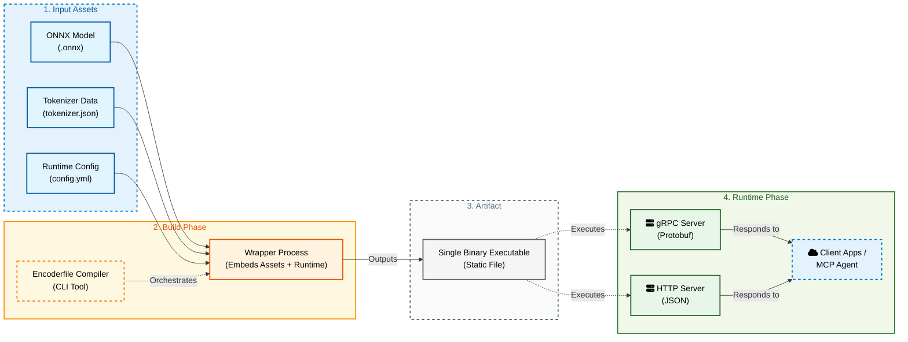

<p align="center">
  <picture>
    
  </picture>
</p>

<p align="center">
  <a href="https://github.com/mozilla-ai/encoderfile/actions/workflows/pre-commit.yaml">
    
  </a>
  <a href="https://github.com/mozilla-ai/encoderfile/actions/workflows/ci.yaml">
    
  </a>
  <a href="https://github.com/mozilla-ai/encoderfile/actions/workflows/docs.yaml">
    
  </a>
</p>

<p align="center">
  <a href="https://discord.com/invite/KTA26kGRyv">
    
  </a>
  <a href="https://codspeed.io/mozilla-ai/encoderfile?utm_source=badge">
    
  </a>
  <a href="https://codecov.io/gh/mozilla-ai/encoderfile">
    
  </a>
</p>

## 🚀 Overview

Encoderfile packages transformer encoders—optionally with classification heads—into a single, self-contained executable.
No Python runtime, no dependencies, no network calls. Just a fast, portable binary that runs anywhere.

While Llamafile focuses on generative models, Encoderfile is purpose-built for encoder architectures with optional classification heads. It supports embedding, sequence classification, and token classification models—covering most encoder-based NLP tasks, from text similarity to classification and tagging—all within one compact binary.

Under the hood, Encoderfile uses ONNX Runtime for inference, ensuring compatibility with a wide range of transformer architectures.

**Why?**

- **Smaller footprint:** a single binary measured in tens-to-hundreds of megabytes, not gigabytes of runtime and packages
- **Compliance-friendly:** deterministic, offline, security-boundary-safe
- **Integration-ready:** drop into existing systems as a CLI, microservice, or API without refactoring your stack

Encoderfiles can run as:

- REST API
- gRPC microservice
- CLI for batch processing
- MCP server (Model Context Protocol)



### Supported Architectures

Encoderfile supports the following Hugging Face model classes (and their ONNX-exported equivalents):

| Task                                | Supported classes                    | Examples models                                                          |
| ----------------------------------- | ------------------------------------ | ----------------------------------------------------------------------- |
| **Embeddings / Feature Extraction** | `AutoModel`, `AutoModelForMaskedLM`  | `bert-base-uncased`, `distilbert-base-uncased`          |
| **Sequence Classification**         | `AutoModelForSequenceClassification` | `distilbert-base-uncased-finetuned-sst-2-english`, `roberta-large-mnli` |
| **Token Classification**            | `AutoModelForTokenClassification`    | `dslim/bert-base-NER`, `bert-base-cased-finetuned-conll03-english`      |

- ✅ All architectures must be encoder-only transformers — no decoders, no encoder–decoder hybrids (so no T5, no BART).
- ⚙️ Models must have ONNX-exported weights (`path/to/your/model/model.onnx`).
- 🧠 The ONNX graph input must include `input_ids` and optionally `attention_mask`.
- 🚫 Models relying on generation heads (AutoModelForSeq2SeqLM, AutoModelForCausalLM, etc.) are not supported.
- `XLNet`, `Transfomer XL`, and derivative architectures are not yet supported.

## 📦 Installation

### Option 1: Download Pre-built CLI Tool (Recommended)

Download the encoderfile CLI tool to build your own model binaries:

**Linux (x86_64):**
```bash
# TODO: Add download URL
curl -L -o encoderfile <Download URL>
chmod +x encoderfile
```

**macOS (Apple Silicon):**
```bash
# TODO: Add download URL
curl -L -o encoderfile <Download URL>
chmod +x encoderfile
```

**macOS (Intel):**
```bash
# TODO: Add download URL
curl -L -o encoderfile <Download URL>
chmod +x encoderfile
```

> **Note for Windows users:** Pre-built binaries are not available for Windows. Please see [BUILDING.md](BUILDING.md) for instructions on building from source.

Move the binary to a location in your PATH:
```bash
# Linux/macOS
sudo mv encoderfile /usr/local/bin/

# Or add to your user bin
mkdir -p ~/.local/bin
mv encoderfile ~/.local/bin/
```

### Option 2: Build CLI Tool from Source

See [BUILDING.md](BUILDING.md) for detailed instructions on building the CLI tool from source.

Quick build:
```bash
cargo build --bin encoderfile --release
./target/release/encoderfile --help
```

## 🚀 Quick Start

### Step 1: Prepare Your Model

First, you need an ONNX-exported model. Export any HuggingFace model:

```bash
# Install optimum for ONNX export
pip install optimum[exporters]

# Export a sentiment analysis model
optimum-cli export onnx \
  --model distilbert-base-uncased-finetuned-sst-2-english \
  --task text-classification \
  ./sentiment-model
```

### Step 2: Create Configuration File

Create `sentiment-config.yml`:

```yaml
encoderfile:
  name: sentiment-analyzer
  path: ./sentiment-model
  model_type: sequence_classification
  output_path: ./build/sentiment-analyzer.encoderfile
```

### Step 3: Build Your Encoderfile

Use the downloaded `encoderfile` CLI tool:

```bash
encoderfile build -f sentiment-config.yml
```

This creates a self-contained binary at `./build/sentiment-analyzer.encoderfile`.

### Step 4: Run Your Model

Start the server:

```bash
./build/sentiment-analyzer.encoderfile serve
```

The server will start on `http://localhost:8080` by default.

### Making Predictions

**Sentiment Analysis:**
```bash
curl -X POST http://localhost:8080/predict \
  -H "Content-Type: application/json" \
  -d '{
    "inputs": [
      "This is the cutest cat ever!",
      "Boring video, waste of time",
      "These cats are so funny!"
    ]
  }'
```

**Response:**
```json
{
  "results": [
    {
      "logits": [0.00021549065, 0.9997845],
      "scores": [0.00021549074, 0.9997845],
      "predicted_index": 1,
      "predicted_label": "POSITIVE"
    },
    {
      "logits": [0.9998148, 0.00018516644],
      "scores": [0.9998148, 0.0001851664],
      "predicted_index": 0,
      "predicted_label": "NEGATIVE"
    },
    {
      "logits": [0.00014975034, 0.9998503],
      "scores": [0.00014975043, 0.9998503],
      "predicted_index": 1,
      "predicted_label": "POSITIVE"
    }
  ],
  "model_id": "sentiment-analyzer"
}
```

**Embeddings:**
```bash
curl -X POST http://localhost:8080/predict \
  -H "Content-Type: application/json" \
  -d '{
    "inputs": ["Hello world"],
    "normalize": true
  }'
```

**Token Classification (NER):**
```bash
curl -X POST http://localhost:8080/predict \
  -H "Content-Type: application/json" \
  -d '{
    "inputs": ["Apple Inc. is located in Cupertino, California"]
  }'
```

## 🎯 Usage Modes

### 1. REST API Server

Start an HTTP server (default port 8080):

```bash
./my-model.encoderfile serve
```

**Custom configuration:**
```bash
./my-model.encoderfile serve \
  --http-port 3000 \
  --http-hostname 0.0.0.0
```

**Disable gRPC (HTTP only):**
```bash
./my-model.encoderfile serve --disable-grpc
```

### 2. gRPC Server

Start with default gRPC server (port 50051):

```bash
./my-model.encoderfile serve
```

**gRPC only (no HTTP):**
```bash
./my-model.encoderfile serve --disable-http
```

**Custom gRPC configuration:**
```bash
./my-model.encoderfile serve \
  --grpc-port 50052 \
  --grpc-hostname localhost
```

### 3. CLI Inference

Run one-off inference without starting a server:

```bash
# Single input
./my-model.encoderfile infer "This is a test sentence"

# Multiple inputs
./my-model.encoderfile infer "First text" "Second text" "Third text"

# Save output to file
./my-model.encoderfile infer "Test input" -o results.json
```

### 4. MCP Server

Run as a Model Context Protocol server:

```bash
./my-model.encoderfile mcp --hostname 0.0.0.0 --port 9100
```

## 🔧 Server Configuration

### Port Configuration

```bash
# Custom HTTP port
./my-model.encoderfile serve --http-port 3000

# Custom gRPC port
./my-model.encoderfile serve --grpc-port 50052

# Both
./my-model.encoderfile serve --http-port 3000 --grpc-port 50052
```

### Hostname Configuration

```bash
./my-model.encoderfile serve \
  --http-hostname 127.0.0.1 \
  --grpc-hostname localhost
```

### Service Selection

```bash
# HTTP only
./my-model.encoderfile serve --disable-grpc

# gRPC only
./my-model.encoderfile serve --disable-http
```

## 📚 Documentation 

-- TODO : Needs the right links

- **[Getting Started Guide](https://mozilla-ai.github.io/encoderfile/getting-started/)** - Step-by-step tutorial
- **[Building Guide](BUILDING.md)** - Build encoderfiles from ONNX models
- **[CLI Reference](https://mozilla-ai.github.io/encoderfile/cli/)** - Complete command-line documentation
- **[API Reference](https://mozilla-ai.github.io/encoderfile/api-reference/)** - REST, gRPC, and MCP API docs

## 🛠️ Building Custom Encoderfiles

Once you have the `encoderfile` CLI tool installed, you can build binaries from any compatible HuggingFace model.

See [BUILDING.md](BUILDING.md) for detailed instructions including:

- How to export models to ONNX format
- Configuration file options
- Advanced features (Lua transforms, custom paths, etc.)
- Troubleshooting tips

**Quick workflow:**

1. Export your model to ONNX: `optimum-cli export onnx ...`
2. Create a config file: `config.yml`
3. Build the binary: `encoderfile build -f config.yml`
4. Deploy anywhere: `./build/my-model.encoderfile serve`

## 🤝 Contributing

We welcome contributions! See [CONTRIBUTING.md](CONTRIBUTING.md) for guidelines.

### Development Setup

```bash
# Clone the repository
git clone https://github.com/mozilla-ai/encoderfile.git
cd encoderfile

# Set up development environment
make setup

# Run tests
make test

# Build documentation - Check command with Raz
make docs-serve
```

## 📄 License

This project is licensed under the Apache License 2.0 - see the [LICENSE](LICENSE) file for details.

## 🙏 Acknowledgments

- Built with [ONNX Runtime](https://onnxruntime.ai/)
- Inspired by [Llamafile](https://github.com/Mozilla-Ocho/llamafile)
- Powered by the Hugging Face model ecosystem

## 💬 Community

- [Discord](https://discord.com/invite/KTA26kGRyv) - Join our community
- [GitHub Issues](https://github.com/mozilla-ai/encoderfile/issues) - Report bugs or request features
- [GitHub Discussions](https://github.com/mozilla-ai/encoderfile/discussions) - Ask questions and share ideas
