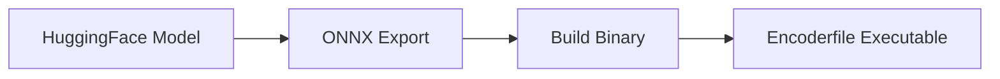

# Building Encoderfiles

This guide covers advanced topics for building and optimizing encoderfiles.

## Build Process Overview

Building an encoderfile involves three main steps:

1. **Export to ONNX** - Convert HuggingFace model to ONNX format
2. **Build Binary** - Compile Rust binary with embedded model assets
3. **Run & Deploy** - Execute the self-contained binary



## ONNX Export

### Basic Export

The `optimum-cli` tool handles ONNX export:

```bash
optimum-cli export onnx \
  --model <model_id> \
  --task <task_type> \
  <output_directory>
```

### Task Types

| Task | Description | Use Case |
|------|-------------|----------|
| `feature-extraction` | Extract embeddings | Semantic search, similarity |
| `text-classification` | Classify sequences | Sentiment, topic classification |
| `token-classification` | Label tokens | NER, POS tagging |

### Export from HuggingFace Hub

```bash
# From model ID
optimum-cli export onnx \
  --model distilbert-base-uncased \
  --task feature-extraction \
  ./my-model
```

### Export from Local Model

```bash
# From local directory
optimum-cli export onnx \
  --model ./path/to/local/model \
  --task text-classification \
  ./output-model
```

### Export with Specific ONNX Opset

```bash
optimum-cli export onnx \
  --model bert-base-uncased \
  --task feature-extraction \
  --opset 14 \
  ./my-model
```

### Verifying ONNX Export

After export, verify the model directory contains:

```
my-model/
├── config.json              ✅ Required
├── model.onnx               ✅ Required
├── tokenizer.json           ✅ Required
├── tokenizer_config.json
├── special_tokens_map.json
└── vocab.txt
```

!!! warning "Required Files"
    The build process requires these three files:

    - `model.onnx` - ONNX weights
    - `tokenizer.json` - Tokenizer configuration
    - `config.json` - Model configuration

## Building the Binary

### Basic Build

First, create a configuration file `config.yml`:

```yaml
encoderfile:
  name: <model_name>
  path: <model_directory>
  model_type: <model_type>
  output_dir: ./build
```

Then build:

```bash
# First, build the CLI tool
cargo build -p encoderfile --bin cli --release

# Then use it to build your model
./target/release/cli build -f config.yml
```

### Build Parameters

#### CLI Options

| Option | Short | Required | Description |
|--------|-------|----------|-------------|
| `--config` | `-f` | Yes | Path to YAML configuration file |
| `--output-dir` | - | No | Override output directory from config |
| `--cache-dir` | - | No | Override cache directory from config |
| `--no-build` | - | No | Generate project without building |

#### Configuration File

| Field | Required | Default | Description |
|-------|----------|---------|-------------|
| `name` | Yes | - | Model identifier (used in API responses) |
| `path` | Yes | - | Path to model directory or explicit file paths |
| `model_type` | Yes | - | Model type: `embedding`, `sequence_classification`, `token_classification` |
| `version` | No | `"0.1.0"` | Model version string |
| `output_dir` | No | Current directory | Where to output the built binary |
| `cache_dir` | No | System cache | Where to store generated files |
| `transform` | No | `None` | Optional Lua transform script |
| `build` | No | `true` | Whether to compile the binary |

### Model Types

#### Embedding Models

For models using `AutoModel` or `AutoModelForMaskedLM`:

```yaml
# embedding-config.yml
encoderfile:
  name: my-embedder
  path: ./embedding-model
  model_type: embedding
  output_dir: ./build
```

```bash
./target/release/cli build -f embedding-config.yml
```

**Examples:**
- `bert-base-uncased`
- `distilbert-base-uncased`
- `sentence-transformers/all-MiniLM-L6-v2`

#### Sequence Classification Models

For models using `AutoModelForSequenceClassification`:

```yaml
# classifier-config.yml
encoderfile:
  name: my-classifier
  path: ./classifier-model
  model_type: sequence_classification
  output_dir: ./build
```

```bash
./target/release/cli build -f classifier-config.yml
```

**Examples:**
- `distilbert-base-uncased-finetuned-sst-2-english` (sentiment)
- `roberta-large-mnli` (natural language inference)
- `facebook/bart-large-mnli` (entailment)

#### Token Classification Models

For models using `AutoModelForTokenClassification`:

```yaml
# ner-config.yml
encoderfile:
  name: my-ner
  path: ./ner-model
  model_type: token_classification
  output_dir: ./build
```

```bash
./target/release/cli build -f ner-config.yml
```

**Examples:**
- `dslim/bert-base-NER`
- `bert-base-cased-finetuned-conll03-english`
- `dbmdz/bert-large-cased-finetuned-conll03-english`

## Build Artifacts

After a successful build, you'll find:

```
target/
└── release/
    └── encoderfile    # Your executable binary
```

The binary is self-contained and includes:

- ONNX model weights
- Tokenizer configuration
- Model metadata
- Full runtime (no dependencies needed)

## Binary Size

Binary size depends on the model:

| Model Type | Typical Size | Example |
|------------|-------------|---------|
| Small (DistilBERT) | 70-100 MB | `distilbert-base-uncased` |
| Medium (BERT-base) | 120-150 MB | `bert-base-uncased` |
| Large (BERT-large) | 350-400 MB | `bert-large-uncased` |

!!! tip "Size Optimization"
    To reduce binary size:

    1. Use distilled models (DistilBERT, DistilRoBERTa)
    2. Use quantized ONNX models
    3. Strip debug symbols: `strip target/release/encoderfile`

## Build Environment

### Environment Variables

The build process sets these environment variables (automatically handled by `encoderbuild`):

```bash
MODEL_WEIGHTS_PATH=./model/model.onnx
TOKENIZER_PATH=./model/tokenizer.json
MODEL_CONFIG_PATH=./model/config.json
MODEL_TYPE=embedding
MODEL_NAME=my-model
```

### Manual Build (Advanced)

If you need to build manually without `encoderbuild`:

```bash
# Set environment variables
export MODEL_WEIGHTS_PATH=/path/to/model.onnx
export TOKENIZER_PATH=/path/to/tokenizer.json
export MODEL_CONFIG_PATH=/path/to/config.json
export MODEL_TYPE=embedding
export MODEL_NAME=my-model

# Build with cargo
cd encoderfile
cargo build --release
```

## Cross-Platform Builds

### Building for Different Targets

```bash
# Install target
rustup target add x86_64-unknown-linux-musl

# Build for target
cargo build --release --target x86_64-unknown-linux-musl
```

### Common Targets

| Target | Platform |
|--------|----------|
| `x86_64-unknown-linux-gnu` | Linux (glibc) |
| `x86_64-unknown-linux-musl` | Linux (static, no glibc) |
| `x86_64-apple-darwin` | macOS (Intel) |
| `aarch64-apple-darwin` | macOS (Apple Silicon) |
| `x86_64-pc-windows-msvc` | Windows |

## Model Configuration

### config.json Structure

The `config.json` file from your model should contain:

```json
{
  "model_type": "distilbert",
  "architectures": ["DistilBertForSequenceClassification"],
  "pad_token_id": 0,
  "id2label": {
    "0": "NEGATIVE",
    "1": "POSITIVE"
  },
  "label2id": {
    "NEGATIVE": 0,
    "POSITIVE": 1
  }
}
```

**Key Fields:**

- `model_type` - Architecture identifier
- `pad_token_id` - Padding token ID
- `id2label` - Label mappings (classification models only)
- `label2id` - Reverse label mappings (classification models only)

## Validation

### Automatic Validation

The build process validates:

- ✅ ONNX model inputs include `input_ids`
- ✅ ONNX model has correct output shape
- ✅ Tokenizer loads successfully
- ✅ Model type matches ONNX architecture

### Manual Testing

After building, test your encoderfile:

```bash
# Test health endpoint
./target/release/encoderfile serve &
curl http://localhost:8080/health

# Test inference
curl -X POST http://localhost:8080/predict \
  -H "Content-Type: application/json" \
  -d '{"inputs": ["test input"]}'
```

## Optimization Tips

### Model Optimization

1. **Use Quantization**

   ```bash
   optimum-cli export onnx \
     --model bert-base-uncased \
     --task feature-extraction \
     --optimize O3 \
     ./optimized-model
   ```

2. **Use Distilled Models**

   Prefer `distilbert`, `distilroberta`, etc. for faster inference and smaller binaries.

3. **Reduce Sequence Length**

   Configure `max_length` in tokenizer_config.json:

   ```json
   {
     "max_length": 128
   }
   ```

### Build Optimization

1. **Release Build with LTO**

   Add to `Cargo.toml`:

   ```toml
   [profile.release]
   lto = true
   codegen-units = 1
   ```

2. **Strip Debug Symbols**

   ```bash
   strip target/release/encoderfile
   ```

3. **Use musl for Static Linking** (Linux)

   ```bash
   rustup target add x86_64-unknown-linux-musl
   cargo build --release --target x86_64-unknown-linux-musl
   ```

## Troubleshooting

### Build Errors

#### "model.onnx not found"

**Problem:** Missing ONNX weights

**Solution:**
```bash
# Re-export the model
optimum-cli export onnx --model <model_id> --task <task> <output>
```

#### "tokenizer.json not found"

**Problem:** Tokenizer file missing

**Solution:**
```bash
# Ensure optimum-cli completed successfully
# Check model directory for tokenizer.json
ls -la <model_directory>
```

#### "Invalid model type"

**Problem:** Model type doesn't match architecture

**Solution:**

- Check `config.json` for `architectures` field
- Ensure model type is correct:
  - `embedding` for `AutoModel`
  - `sequence_classification` for `AutoModelForSequenceClassification`
  - `token_classification` for `AutoModelForTokenClassification`

### ONNX Validation Errors

#### "Input shape mismatch"

**Problem:** ONNX model has unexpected input shape

**Solution:**
```bash
# Re-export with specific opset
optimum-cli export onnx \
  --model <model_id> \
  --task <task> \
  --opset 14 \
  <output>
```

#### "Missing input_ids"

**Problem:** ONNX model doesn't have required `input_ids` input

**Solution:**

This usually means the model architecture is not supported. Check:

1. Model is encoder-only (not decoder or encoder-decoder)
2. Model is not `XLNet` or `Transformer-XL` (not yet supported)

### Runtime Errors

#### "Model inference failed"

**Problem:** Runtime error during inference

**Solution:**

1. Test with simple input: `["test"]`
2. Check input text length (try shorter sequences)
3. Verify model loads: check `/model` endpoint

## Advanced Topics

### Custom Model Architectures

To add support for new architectures:

1. Ensure ONNX export works
2. Verify input/output shapes match expectations
3. Test with sample inputs
4. File an issue/PR if architecture should be supported

### Multi-Model Binaries

Each encoderfile contains one model. To serve multiple models:

1. Build separate binaries for each model
2. Run on different ports
3. Use a reverse proxy (nginx, Caddy) to route requests

### CI/CD Integration

Example GitHub Actions workflow:

```yaml
name: Build Encoderfile

on: [push]

jobs:
  build:
    runs-on: ubuntu-latest
    steps:
      - uses: actions/checkout@v3
      - uses: actions/setup-python@v4
        with:
          python-version: '3.13'
      - uses: dtolnay/rust-toolchain@stable

      - name: Install dependencies
        run: |
          pip install uv
          uv pip install optimum[onnxruntime]

      - name: Export model
        run: |
          optimum-cli export onnx \
            --model distilbert-base-uncased \
            --task feature-extraction \
            ./model

      - name: Build encoderfile
        run: |
          cargo build -p encoderfile --bin cli --release
          ./target/release/cli build -f config.yml

      - uses: actions/upload-artifact@v3
        with:
          name: encoderfile
          path: target/release/encoderfile
```

## Next Steps

- [**CLI Reference**](cli.md) - Learn about CLI options
- [**API Reference**](api-reference.md) - Explore the API
- [**Contributing**](CONTRIBUTING.md) - Help improve encoderfile
